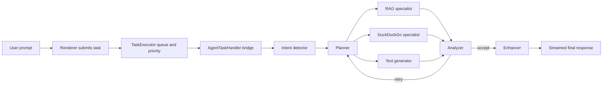

# Agentic Design Patterns In OpenWriter

This document analyzes the patterns collected under `docs/agentic-design-patterns-docs-main` and maps them onto OpenWriter's current architecture.

The source material describes 21 generic agentic patterns. OpenWriter does not implement all 21 directly, but it already contains a coherent subset across the task system, AI graph runtime, retrieval pipeline, and safety boundaries.

## Purpose

Use this document to answer three questions:

1. Which agentic patterns are already present in OpenWriter?
2. Where do those patterns live in the codebase?
3. Which patterns should be added next, and why?

## Current Pattern Stack

## Status Legend

| Status | Meaning |
| --- | --- |
| Implemented | The pattern is explicit in the runtime and used in normal execution. |
| Partial | The pattern exists in limited form, or only part of its usual design is present. |
| Candidate | The pattern is not meaningfully implemented yet. |

## Pattern Matrix

| Pattern | Status | OpenWriter Mapping |
| --- | --- | --- |
| Prompt Chaining | Implemented | Sequential specialist pipeline from intent detection to enhancement. |
| Routing | Implemented | Task routing by handler type and prompt routing by intent classification. |
| Parallelization | Implemented | Planner fans out to RAG, web search, and text generation in parallel. |
| Reflection | Implemented | Analyzer can send the flow back to planner for another pass. |
| Tool Use | Implemented | Filesystem, retrieval, embeddings, DuckDuckGo, IPC, and task APIs. |
| Planning | Implemented | Planner agent generates execution brief, queries, and success criteria. |
| Multi-Agent Collaboration | Implemented | Specialist graph with shared state and role-specific models. |
| Memory Management | Implemented | Conversation history plus workspace vector-store retrieval. |
| Learning And Adaptation | Candidate | No persistent feedback loop or self-improving policy exists yet. |
| Model Context Protocol | Candidate | No MCP-style standardized external tool/server layer in the app runtime. |
| Goal Setting And Monitoring | Partial | Planner defines success criteria; executor reports progress; no goal scorer. |
| Exception Handling And Recovery | Implemented | Cancellation, retries, graceful empty-result fallbacks, and TTL task retention. |
| Human-In-The-Loop | Candidate | No approval, review, or interactive correction checkpoint in agent flows. |
| Knowledge Retrieval (RAG) | Implemented | Workspace indexing and semantic retrieval pipeline. |
| Inter-Agent Communication (A2A) | Partial | Agents communicate through shared graph state, not direct message protocols. |
| Resource-Aware Optimization | Partial | Concurrency limits and node-specific models exist; dynamic budgeting does not. |
| Reasoning Techniques | Partial | Structured prompts exist, but reusable reasoning policies are not formalized. |
| Guardrails / Safety Patterns | Implemented | Path safety, source-bound answers, provider resolution, and tool boundaries. |
| Evaluation And Monitoring | Implemented | Logger, task events, analyzer feedback, and reaction bus support observability. |
| Prioritization | Implemented | TaskExecutor queue priorities reorder execution before start. |
| Exploration And Discovery | Partial | Retrieval and web search discover evidence, but not open-ended exploration loops. |

## Core Patterns Already In Use

### 1. Planning

OpenWriter has a real planning stage, not just a large prompt.

The planner agent produces:

- an execution plan
- a text brief
- a RAG query
- a web search query
- success criteria

This makes the rest of the graph easier to reason about because downstream nodes act on structured intermediate intent instead of reinterpreting the original prompt each time.

Primary code:

- `src/main/ai/assistant/agents/planner-agent.ts`
- `src/main/ai/assistant/graph.ts`

### 2. Routing

Routing appears in two layers.

System routing:

- `TaskHandlerRegistry` selects a handler by task type.
- `AgentTaskHandler` selects an agent definition by agent id.

Prompt routing:

- `intent-detector-agent.ts` decides whether retrieval or external search is needed.
- `graph.ts` routes post-analysis execution either back to planning or forward to enhancement.

Primary code:

- `src/main/task/task-handler-registry.ts`
- `src/main/task/handlers/agent-task-handler.ts`
- `src/main/ai/assistant/agents/intent-detector-agent.ts`
- `src/main/ai/assistant/graph.ts`

### 3. Parallelization

The assistant graph intentionally fans out from planner to three specialists:

- RAG
- DuckDuckGo search
- text generation

That is a strong use of parallelization because it reduces latency and separates evidence gathering from drafting. The analyzer then joins those branches into a single validation step.

Primary code:

- `src/main/ai/assistant/graph.ts`

### 4. Multi-Agent Collaboration

OpenWriter's assistant is already a multi-agent system, even though it runs inside one LangGraph.

The specialists are:

- intent detector
- planner
- RAG agent
- DuckDuckGo search agent
- text generator
- analyzer
- enhancer

This is a specialist-based collaboration pattern with a shared blackboard state instead of explicit direct messaging between agents.

Primary code:

- `src/main/ai/assistant/definition.ts`
- `src/main/ai/assistant/state.ts`
- `src/main/ai/assistant/graph.ts`
- `src/main/ai/assistant/agents/*.ts`

### 5. Reflection

The analyzer node is a clean reflection pattern.

It reviews the outputs of the planner, text branch, RAG branch, and web branch, then decides whether another pass is materially useful. This is stronger than a pure "generate once" design because it can detect weak or misaligned intermediate output before the final answer is streamed.

Current limit:

- reflection is capped at two review passes

Primary code:

- `src/main/ai/assistant/agents/analyzer-agent.ts`
- `src/main/ai/assistant/graph.ts`

### 6. Memory Management

OpenWriter uses two distinct memory layers:

Conversation memory:

- prior completed chat messages are loaded from document-scoped session storage

Workspace memory:

- indexed documents are chunked, embedded, and retrieved from a vector store

This separation is important. Conversation history preserves dialogue continuity; the vector store preserves project knowledge.

Primary code:

- `src/main/task/handlers/agent-task-handler.ts`
- `src/main/task/handlers/indexing-task-handler.ts`
- `src/main/ai/assistant/agents/rag-retriever.ts`
- `src/main/ai/rag/vector-store.ts`

### 7. Tool Use

OpenWriter uses tools in the broader architectural sense, not only model-side function calling.

Current tool surfaces include:

- Electron IPC
- filesystem access
- workspace indexing
- embedding generation
- vector similarity retrieval
- DuckDuckGo external search
- task submission and cancellation

The important design choice is that tool use stays behind trusted main-process boundaries instead of being exposed directly to the renderer.

Primary code:

- `src/main/ipc/*.ts`
- `src/main/task/handlers/*.ts`
- `src/main/ai/assistant/agents/duckduckgo-search.ts`
- `src/main/shared/provider-resolver.ts`

### 8. Knowledge Retrieval (RAG)

RAG is one of the clearest implemented patterns in the repo.

The pipeline is:

1. load workspace documents
2. extract text by file type
3. chunk text
4. embed chunks
5. persist vector store
6. retrieve semantically relevant chunks during assistant execution

This is currently workspace-centric RAG, not arbitrary external corpus retrieval.

Primary code:

- `src/main/task/handlers/indexing-task-handler.ts`
- `src/main/ai/rag/extractor-registry.ts`
- `src/main/ai/rag/text-chunker.ts`
- `src/main/ai/rag/vector-store.ts`
- `src/main/ai/assistant/agents/rag-agent.ts`
- `src/main/ai/assistant/agents/rag-retriever.ts`

### 9. Evaluation And Monitoring

OpenWriter has both runtime monitoring and answer-quality evaluation.

Runtime monitoring:

- task lifecycle events
- logger instrumentation
- task reaction bus
- progress and stream reporting

Answer-quality evaluation:

- analyzer checks whether outputs are coherent and aligned enough to continue

This is a useful distinction because system observability and answer evaluation are related but not the same pattern.

Primary code:

- `src/main/task/task-executor.ts`
- `src/main/task/task-reaction-bus.ts`
- `src/main/services/logger.ts`
- `src/main/ai/assistant/agents/analyzer-agent.ts`

### 10. Guardrails And Safety

OpenWriter already uses several concrete guardrails:

- workspace-derived server-side paths instead of trusting renderer paths
- vector-store path validation before deletion
- RAG and web specialists are instructed not to invent facts beyond supplied evidence
- unresolved retrieval and search cases degrade to explicit "not found" notes
- provider/model resolution stays centralized
- node streaming can be restricted to user-facing graph nodes

These guardrails are pragmatic and code-level, which is stronger than prompt-only safety.

Primary code:

- `src/main/task/handlers/indexing-task-handler.ts`
- `src/main/task/handlers/agent-task-handler.ts`
- `src/main/ai/core/definition.ts`
- `src/main/shared/provider-resolver.ts`

### 11. Prioritization And Resource Awareness

The task system explicitly prioritizes queued work with `high`, `normal`, and `low` weights.

The AI layer also shows an early form of resource-aware optimization:

- fixed task concurrency limit
- node-specific model configuration
- node-specific token ceilings
- selective token streaming from user-facing nodes only

What is still missing is dynamic resource adaptation based on prompt size, retrieval cost, or current queue pressure.

Primary code:

- `src/main/task/task-executor.ts`
- `src/main/ai/assistant/definition.ts`
- `src/main/ai/core/definition.ts`

## Partial Patterns

### Goal Setting And Monitoring

The planner defines success criteria, and the executor reports progress. That is useful, but the system does not yet evaluate whether the final answer actually met the planner's success criteria in a structured way.

Current state:

- goals are generated
- progress is reported
- goals are not formally scored

### Reasoning Techniques

Several nodes use structured output prompts and narrow roles, which is a lightweight reasoning pattern. What is missing is a reusable reasoning policy such as explicit decomposition templates, confidence scoring, or traceable decision schemas across agents.

Current state:

- structured prompts exist
- reasoning is local to each specialist
- reasoning is not standardized across the runtime

### Exploration And Discovery

OpenWriter can search the workspace and the web, but only within a narrow plan-driven path. It does not yet branch into broader exploratory loops such as query reformulation, source comparison, or hypothesis generation.

Current state:

- targeted discovery exists
- open-ended discovery does not

### Inter-Agent Communication (A2A)

The current graph uses shared state as a coordination medium. That is simple and effective, but it is not the same as direct agent-to-agent communication with explicit messages, handoff contracts, or negotiation.

Current state:

- shared-state collaboration exists
- explicit message-based A2A does not

## Candidate Patterns For The Next Iteration

### Human-In-The-Loop

This is the highest-value missing pattern for OpenWriter.

Good insertion points:

- approval before expensive web or image-related operations
- user confirmation before replacing existing document output
- review checkpoints for research summaries or multi-step writing actions

Why it matters:

- reduces wrong autonomous edits
- improves trust
- fits naturally with a writing product

### Learning And Adaptation

There is no durable feedback loop yet.

A pragmatic first version would store:

- accepted vs rejected outputs
- retry frequency
- which branches were used
- which retrieval hits were actually helpful

That would enable later adaptation without jumping straight to full online learning.

### Model Context Protocol

The current system already has strong internal interfaces, but it does not expose a standardized external tool ecosystem. MCP would matter if OpenWriter wants:

- pluggable external data sources
- controlled third-party tool servers
- a stable protocol for agent-side integrations

This is not urgent unless external integrations become a product priority.

## Recommended Architectural Direction

Based on the existing implementation, OpenWriter should keep leaning into a graph-based specialist architecture rather than collapsing back into one general-purpose assistant prompt.

Recommended direction:

1. Keep the current planner -> parallel specialists -> analyzer -> enhancer spine.
2. Add explicit human approval checkpoints for risky or expensive actions.
3. Add structured evaluation output so analyzer results become machine-actionable metrics.
4. Add adaptive resource policies for retrieval depth, model choice, and retry limits.
5. Add explicit branch telemetry so future learning and optimization have real data.

## Design Principles For New Agent Work

When adding new agent features, prefer these rules:

- add a specialist when the task has a distinct responsibility, output contract, or model profile
- add a tool when the task needs deterministic I/O or side effects
- add a planner output field before adding a new branch with hidden implicit logic
- add a reflection checkpoint before increasing autonomy
- add a guardrail in code when failure would be expensive or destructive

Avoid these anti-patterns:

- one agent doing classification, retrieval, drafting, evaluation, and final writing in one prompt
- renderer-controlled file paths for privileged actions
- hidden retries with no analyzer rationale
- unbounded search or retrieval loops
- prompt-only safety controls where code-level checks are possible

## Key File Map

| Area | Files |
| --- | --- |
| Task orchestration | `src/main/task/task-executor.ts`, `src/main/task/task-handler-registry.ts`, `src/main/ipc/task-manager-ipc.ts` |
| Agent bridge | `src/main/task/handlers/agent-task-handler.ts` |
| Assistant graph | `src/main/ai/assistant/definition.ts`, `src/main/ai/assistant/graph.ts`, `src/main/ai/assistant/state.ts` |
| Specialist nodes | `src/main/ai/assistant/agents/*.ts` |
| Retrieval pipeline | `src/main/task/handlers/indexing-task-handler.ts`, `src/main/ai/rag/*.ts` |
| Runtime services | `src/main/bootstrap.ts`, `src/main/core/event-bus.ts`, `src/main/services/logger.ts` |

## Summary

OpenWriter already implements a serious subset of the agentic patterns from the source documentation. The strongest current patterns are planning, routing, parallelization, reflection, multi-agent collaboration, RAG, tool use, evaluation, and guardrails.

The main gaps are human-in-the-loop control, persistent learning, dynamic resource adaptation, and a more formalized reasoning/evaluation layer. Those are the right next patterns to add if the goal is to make the assistant more reliable without making it harder to operate.
