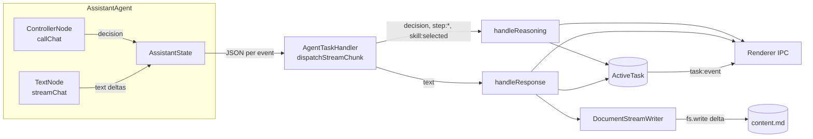

# Agent Streaming

How the assistant agent's output reaches the document file and the task
record in real time.

## Goal

While an `agent` task runs, two things must happen live:

1. Generated text is appended to the document file (`content.md`) token
   by token, without the agent itself touching the filesystem.
2. Partial state (reasoning events, streamed text, token counts) is
   persisted on the `ActiveTask` record so callers can observe progress
   via `task:get` / `task:list`.

The agent emits a stream of events. The task handler classifies each
event as **reasoning** or **response** and drives both side effects.

## Event classification

The assistant emits `StateEvent`s via `AssistantState.subscribe`. The
handler groups them into two behavioural categories:

| Event `kind` | Category | Effect on task |
|---|---|---|
| `decision` | reasoning | append to `reasoningLog`, `progress(0)` |
| `decision:invalid` | reasoning | append to `reasoningLog`, `progress(0)` |
| `skill:selected` | reasoning | append to `reasoningLog`, `progress(0)` |
| `step:begin` | reasoning | append to `reasoningLog`, `progress(0)` |
| `step:end` | reasoning | append to `reasoningLog`, `progress(0)` |
| `text` | response | append delta to `content.md` + `streamedContent`, bump token count, ramp progress |
| `status`, `tool`, `image`, `usage`, `budget` | pass-through | logged, forwarded to renderer, no side effects |

Classification lives in `AgentTaskHandler.dispatchStreamChunk`. Adding a
new reasoning kind means extending the `REASONING_KINDS` set.

## Pipeline



## Components

### `DocumentStreamWriter`

`src/main/task/handlers/document-stream-writer.ts`.

Owns the lifecycle of one document stream for one task run.

```
begin()         mkdir -p, truncate file to empty, open FileHandle in 'w' mode
appendDelta(d)  schedule a write on an internal promise chain (fire-and-forget)
end()           await the chain, close the FileHandle; idempotent
```

`begin()` is serialized against other writers on the same path via
`withFileMutationQueue`. `appendDelta` writes are serialized per writer
via an internal `Promise` chain; per-write errors are caught so the
chain survives and subsequent deltas still flush.

### `TaskStateWriter`

`src/main/task/task-handler.ts`.

```
pushReasoning(entry)
appendResponseDelta(delta)
setTokenCount(count)
```

Built by `TaskExecutor` per task; closes over the `activeTasks` Map
entry so handler mutations are visible to `listTasks` / `getTaskResult`.

### `ActiveTask` — new fields

`src/main/task/task-descriptor.ts`.

| Field | Type | Meaning |
|---|---|---|
| `reasoningLog` | `ReasoningLogEntry[]` | All reasoning events observed, in order |
| `streamedContent` | `string` | Full response text accumulated from deltas |
| `tokenCount` | `number` | Running count of response deltas |

`ReasoningLogEntry = { at: number; kind: string; payload: unknown }`.

### `TextNode` — streaming + no file tools

`src/main/agents/assistant/nodes/text-node.ts`.

- Calls `streamChat` (not `callChat`).
- Invokes `state.emitTextDelta(delta)` for every content chunk from
  the LLM stream. That emits a `text` event per token.
- Tools registered: `read` only. `write` and `edit` are no longer
  registered — the handler owns the file.
- When an iteration ends with no tool calls,
  `state.finalizeTextSegment()` moves the streamed segment into
  `_textSegments` so `state.finalText` reflects the full output.

### `streamChat`

`src/main/agents/assistant/llm-call.ts`.

Wraps `client.chat.completions.create({ stream: true, stream_options:
{ include_usage: true } })`. Accumulates content and tool-call
fragments per `chunk.choices[0].delta`, then returns a
`ChatCompletion`-shaped aggregate so callers reuse the same
post-processing as `callChat`. Charges the run budget from the usage
reported in the final chunk. No retry/backoff — callers needing retry
should fall back to `callChat`.

### `AgentTaskHandler`

`src/main/task/handlers/agent-task-handler.ts`.

On `execute`:

1. `enrichInput` resolves credentials, `documentPath`, `workspacePath`.
2. `initDocumentWriter` opens and truncates `content.md` when
   `documentPath` is present. Failure is logged and the writer is
   dropped — the agent still runs, with file writes disabled.
3. `reporter.progress(0, 'reasoning')` publishes the initial state.
4. `agent.execute` is invoked with a `ctx.stream` that dispatches every
   JSON chunk through `dispatchStreamChunk`.
5. Agent-reported `ctx.progress` calls are **ignored**; the handler
   owns task progress exclusively.
6. On resolve: `writer.end()`, `reporter.progress(100, 'done')`.
7. On reject: `writer.end()` still runs (finally-style), partial
   `content.md` is preserved.

## Progress semantics

| Phase | Percent |
|---|---|
| Pre-run | `0, 'reasoning'` |
| Any reasoning event | `0, 'reasoning'` |
| Response delta | `rampPct(tokenCount), 'response'` |
| Success | `100, 'done'` |

`rampPct(n) = min(99, round(n * 0.5))`. 200 deltas saturate the cap at
99 %; the jump to 100 % only happens on completion.

## Task record lifecycle (example)

```
submit   → status='queued'                                     reasoningLog=[]  streamedContent=''  tokenCount=0
started  → status='running'                                    (unchanged)
decision → reasoningLog=[{kind:'decision',...}]                progress=0
step:begin → reasoningLog=[..., {kind:'step:begin',...}]       progress=0
text     → streamedContent='Hello'     tokenCount=1            progress=1
text     → streamedContent='Hello, '   tokenCount=2            progress=1
... (many text events)                                         progress ramps to 99
step:end → reasoningLog=[..., {kind:'step:end',...}]           progress=0
done     → status='completed'                                  progress=100
```

## Error handling

| Failure | Effect |
|---|---|
| `writer.begin()` fails | writer dropped, warned in log, agent still runs without file writes |
| `writer.write()` fails mid-stream | error caught on the chain, logged, subsequent writes still flush |
| Agent throws (`AbortError`) | `writer.end()` in catch, task `cancelled`, partial `content.md` retained |
| Agent throws (any other) | `writer.end()` in catch, task `error`, partial `content.md` retained |
| No `documentPath` resolved | no writer created, response events still populate `streamedContent` on the task |

## Known limitations

- **Content leakage on tool-call iterations.** `streamChat` emits
  deltas live. If the model produces content *and* a tool call in the
  same iteration, the content has already been written to `content.md`
  before the tool call is known. With only `read` registered this is
  uncommon in practice.
- **Concurrent tasks on the same document.** `withFileMutationQueue`
  serializes `begin()`, but two writers may hold open `FileHandle`s on
  the same path simultaneously. If task B calls `begin()` while task A
  is still appending, B's `'w'` open truncates the file. Queue this
  at the task-submit layer if concurrent edits become real.
- **No resume.** `content.md` is truncated at task start. If the user
  cancels, the previous document state is gone.

## Extension points

- **New reasoning source.** Emit a new `StateEventKind` and add it to
  `REASONING_KINDS` in the handler. No other change is needed.
- **Debounced writes.** Replace the per-delta `handle.write` with a
  buffered flush inside `DocumentStreamWriter`. The public API does
  not change.
- **Richer progress.** Swap `rampPct` for a budget-aware calculation
  that divides `tokenCount` by `input.maxTokens`. The token count is
  already persisted on the task record.

## Touched files

```
src/main/task/handlers/agent-task-handler.ts      refactor — stream dispatch, writer lifecycle, progress
src/main/task/handlers/document-stream-writer.ts  new     — fs lifecycle for content.md
src/main/task/task-handler.ts                     add     — TaskStateWriter interface, execute() signature
src/main/task/task-descriptor.ts                  add     — reasoningLog, streamedContent, tokenCount, ReasoningLogEntry
src/main/task/task-executor.ts                    add     — build TaskStateWriter, expose new fields in listTasks
src/main/agents/assistant/llm-call.ts             add     — streamChat, stream types
src/main/agents/assistant/state/assistant-state.ts add    — emitTextDelta, finalizeTextSegment, _currentSegment
src/main/agents/assistant/nodes/text-node.ts      refactor — streamChat, remove write/edit tools, per-delta emit
```
