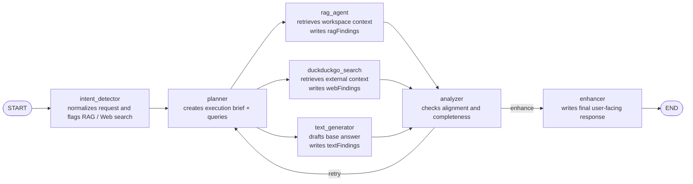

# Assistant Multi-Agent Guide

## Purpose

`src/main/ai/assistant` implements the general-purpose assistant used for chat.

The assistant is now text-only:

- an intent detector normalizes the request and decides whether retrieval or
  web search are needed
- the text route runs `planner -> parallel specialists -> analyzer -> enhancer`
- the analyzer can send the text route back through the planner for one more pass

If the user asks for an image or other visual asset, the assistant answers in
text and makes the limitation explicit instead of trying to generate media.

## Visual Graph

## Runtime Flow

1. `intent_detector`
   Normalizes the request and flags whether the text branch should use
   workspace retrieval or DuckDuckGo search.

2. `planner`
   Creates the execution brief and specialist queries.

3. Parallel specialists
   `rag_agent`, `duckduckgo_search`, and `text_generator` run in parallel.

4. `analyzer`
   Reviews the specialist outputs against the prompt.
   If they are materially misaligned, it routes back to `planner`.

5. `enhancer`
   Produces the final user-facing text response once the analyzer accepts the
   branch output or the retry budget is exhausted.

## State Shape

The shared graph state in `state.ts` contains:

- `prompt`: current user input
- `history`: prior chat turns
- `normalizedPrompt`: intent-normalized request
- `intentFindings`: internal routing note
- `needsRetrieval`: whether the assistant should use workspace retrieval
- `needsWebSearch`: whether the assistant should use DuckDuckGo search
- `plannerFindings`: planner brief
- `ragQuery`: planner-specified workspace query
- `webSearchQuery`: planner-specified external search query
- `textFindings`: internal text draft from the text generator
- `ragFindings`: workspace retrieval summary
- `webFindings`: DuckDuckGo search summary
- `analysisFindings`: analyzer verdict and retry guidance
- `shouldRetry`: whether the analyzer requested another planning pass
- `reviewCount`: completed analyzer passes
- `phaseLabel`: UI-visible progress label
- `response`: final user-facing output

## Files

- `definition.ts`
  Declares assistant metadata, per-specialist model map, graph preparation, and
  input/output extraction.

- `graph.ts`
  Builds the LangGraph topology shown above.

- `messages.ts`
  Defines phase labels such as `Planning response...` and
  `Polishing response...`.

- `agent-output.ts`
  Small helpers for parsing labeled LLM outputs.

- `agents/intent_detector/`
  Detects retrieval/search needs and writes routing fields.

- `agents/planner/`
  Builds the execution brief and specialist queries.

- `agents/rag_agent/`
  Retrieves indexed workspace context and produces `ragFindings`.

- `agents/duckduckgo_search/`
  Performs best-effort DuckDuckGo search and produces `webFindings`.

- `agents/text_generator/`
  Produces the base answer draft in `textFindings`.

- `agents/analyzer/`
  Evaluates the specialist outputs and decides whether to retry.

- `agents/enhancer/`
  Produces the final user-facing text response.
