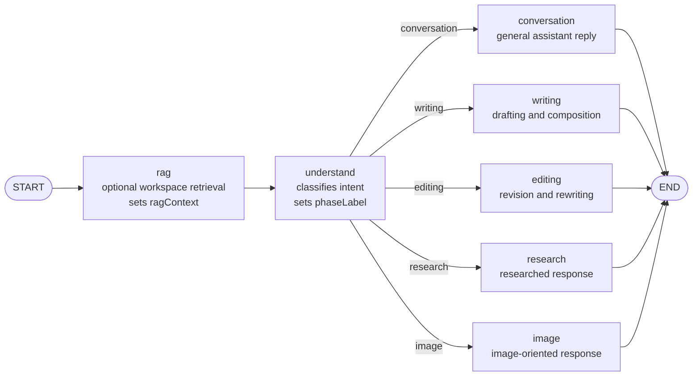

# Assistant Multi-Agent Guide

## Purpose

`src/main/ai/assistant` implements the routed assistant used for general chat,
writing, editing, research, and image-oriented requests.

The architecture is a small multi-agent graph:

- a retrieval step enriches the request with workspace context
- a router step classifies the user intent
- a specialist node handles the final response

## Visual Graph

## Runtime Flow

1. `rag`
   Looks up workspace context through `RagRetriever` when a workspace path is available.
   If retrieval is unavailable, it returns an empty `ragContext`.

2. `understand`
   Uses the understanding prompt and chat history to classify the request into one of:
   `conversation`, `writing`, `editing`, `research`, or `image`.

3. specialist node
   Routes to exactly one final node:
   `conversation`, `writing`, `editing`, `research`, or `image`.

## State Shape

The shared graph state in `state.ts` contains:

- `prompt`: current user input
- `history`: prior chat turns
- `intent`: routed destination, defaulting to `conversation`
- `phaseLabel`: UI-visible progress label
- `response`: final specialist output
- `ragContext`: retrieved workspace context for downstream nodes

## Files

- `definition.ts`
  Declares the assistant agent metadata, node model map, graph preparation, and
  input/output extraction.

- `graph.ts`
  Builds the LangGraph topology shown above.

- `messages.ts`
  Defines phase labels such as `Understanding request...` and
  `Preparing researched response...`.

- `nodes/understand/`
  Router logic that selects the specialist path.

- `nodes/conversation/`
  Default conversational answer path.

- `nodes/writing/`
  Drafting and long-form generation path.

- `nodes/editing/`
  Revision and rewrite path.

- `nodes/research/`
  Research-oriented answer path.

- `nodes/image/`
  Image-request handling path.

- `nodes/rag/`
  Workspace retrieval path that prepares `ragContext`.
