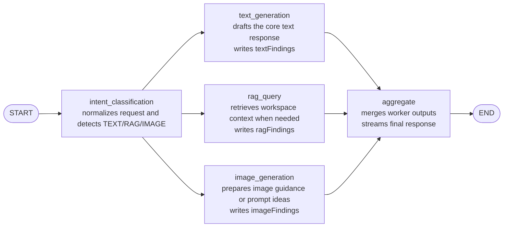

# Assistant Multi-Agent Guide

## Purpose

`src/main/ai/assistant` implements the general assistant used for chat,
writing, research, and broader helper workflows.

The architecture now mirrors a classifier-first multi-agent flow:

- an intent-classification worker determines which capabilities are needed
- a text-generation worker drafts the primary answer
- a RAG worker retrieves workspace context when needed
- an image-generation worker prepares visual guidance when the user asks for an image
- an aggregator produces the final user-facing response

## Visual Graph

## Runtime Flow

1. `intent_classification`
   Rewrites the request into a normalized form and flags whether the request
   needs a text answer, workspace retrieval, and image guidance.

2. `text_generation`
   Produces the best standalone text draft it can without workspace retrieval.

3. `rag_query`
   Retrieves relevant workspace snippets through `RagRetriever` when the
   classifier says retrieval is needed and a workspace index is available.

4. `image_generation`
   Produces a concise internal note for visual requests. Because the current
   task/chat contract is text-only, this node prepares prompt guidance rather
   than returning a binary image asset.

5. `aggregate`
   Reads the original request, conversation history, intent findings, text
   draft, retrieval findings, and image note, then produces the final
   user-facing response.

`text_generation`, `rag_query`, and `image_generation` run in parallel after
`intent_classification`. `aggregate` waits for all three.

## State Shape

The shared graph state in `state.ts` contains:

- `prompt`: current user input
- `history`: prior chat turns
- `normalizedPrompt`: classifier-normalized version of the request
- `intentFindings`: internal note describing detected intents and routing
- `needsRetrieval`: whether the RAG branch should use workspace context
- `needsImageGeneration`: whether the image branch should prepare visual guidance
- `textFindings`: internal text draft from the text-generation worker
- `ragFindings`: retrieval worker summary for the current request
- `imageFindings`: image guidance note or a no-op marker
- `phaseLabel`: UI-visible progress label
- `response`: final aggregator output

## Files

- `definition.ts`
  Declares the assistant agent metadata, per-node model map, graph preparation,
  and input/output extraction.

- `graph.ts`
  Builds the classifier-first LangGraph topology shown above.

- `messages.ts`
  Defines phase labels such as `Classifying request...` and
  `Running assistant specialists...`.

- `nodes/intent_classification/`
  Detects the request shape and writes `normalizedPrompt`, `intentFindings`,
  `needsRetrieval`, and `needsImageGeneration`.

- `nodes/text_generation/`
  Produces the primary text draft in `textFindings`.

- `nodes/rag/`
  Retrieval worker that queries indexed workspace context and produces
  `ragFindings`.

- `nodes/image_generation/`
  Produces visual guidance in `imageFindings` for requests that ask for an image.

- `nodes/aggregate/`
  Final response writer that combines all worker outputs into `response`.
