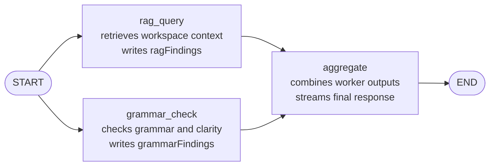

# Assistant Multi-Agent Guide

## Purpose

`src/main/ai/assistant` implements the assistant used for general chat,
writing, editing, research, and other general requests.

The architecture is a small multi-agent graph:

- a RAG worker analyzes workspace context
- a grammar worker analyzes the request wording
- an aggregator produces the final response from both results

## Visual Graph

## Runtime Flow

1. `rag_query`
   Retrieves relevant workspace snippets through `RagRetriever` when a workspace
   path is available, then turns them into a concise internal note stored in
   `ragFindings`.

2. `grammar_check`
   Reviews the latest request for grammar, clarity, and ambiguity, then stores
   a concise internal note in `grammarFindings`.

3. `aggregate`
   Reads the original request, conversation history, `ragFindings`, and
   `grammarFindings`, then produces the final user-facing response.

`rag_query` and `grammar_check` run in parallel. `aggregate` waits for both.

## State Shape

The shared graph state in `state.ts` contains:

- `prompt`: current user input
- `history`: prior chat turns
- `ragFindings`: retrieval worker summary for the current request
- `grammarFindings`: grammar and clarity worker summary
- `phaseLabel`: UI-visible progress label
- `response`: final aggregator output

## Files

- `definition.ts`
  Declares the assistant agent metadata, node model map, graph preparation, and
  input/output extraction.

- `graph.ts`
  Builds the LangGraph topology shown above.

- `messages.ts`
  Defines phase labels such as `Running assistant checks...` and
  `Composing response...`.

- `nodes/rag/`
  Retrieval worker that queries indexed workspace context and produces
  `ragFindings`.

- `nodes/grammar_check/`
  Grammar and clarity worker that produces `grammarFindings`.

- `nodes/aggregate/`
  Final response writer that combines both worker outputs into `response`.
