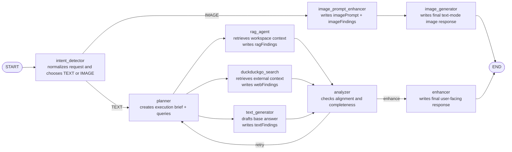

# Assistant Multi-Agent Guide

## Purpose

`src/main/ai/assistant` implements the general-purpose assistant used for chat.

The runtime now tracks the reference design much more closely:

- an intent detector chooses the primary `TEXT` or `IMAGE` route
- the image route runs `image_prompt_enhancer -> image_generator`
- the text route runs `planner -> parallel specialists -> analyzer -> enhancer`
- the analyzer can send the text route back through the planner for one more pass

The main pragmatic deviation is transport, not orchestration:

- the image branch still returns a text response package for chat because the
  assistant contract currently streams text, not a binary image artifact

## Visual Graph

## Runtime Flow

1. `intent_detector`
   Normalizes the request, chooses the primary route, and flags whether the
   text branch should use workspace retrieval or DuckDuckGo search.

2. Image branch
   `image_prompt_enhancer` strengthens the prompt.
   `image_generator` turns that into the final chat response for image requests.

3. Text branch
   `planner` creates the execution brief and specialist queries.
   `rag_agent`, `duckduckgo_search`, and `text_generator` run in parallel.

4. `analyzer`
   Reviews the specialist outputs against the prompt.
   If they are materially misaligned, it routes back to `planner`.

5. `enhancer`
   Produces the final user-facing text response once the analyzer accepts the
   text branch output or the retry budget is exhausted.

## State Shape

The shared graph state in `state.ts` contains:

- `prompt`: current user input
- `history`: prior chat turns
- `normalizedPrompt`: intent-normalized request
- `route`: primary branch, `text` or `image`
- `intentFindings`: internal routing note
- `needsRetrieval`: whether the text branch should use workspace retrieval
- `needsWebSearch`: whether the text branch should use DuckDuckGo search
- `needsImageGeneration`: whether the image branch should run
- `plannerFindings`: planner brief for the text branch
- `ragQuery`: planner-specified workspace query
- `webSearchQuery`: planner-specified external search query
- `textFindings`: internal text draft from the text generator
- `ragFindings`: workspace retrieval summary
- `webFindings`: DuckDuckGo search summary
- `analysisFindings`: analyzer verdict and retry guidance
- `shouldRetry`: whether the analyzer requested another planning pass
- `reviewCount`: completed analyzer passes
- `imagePrompt`: enhanced image-generation prompt
- `imageFindings`: internal image-branch note
- `phaseLabel`: UI-visible progress label
- `response`: final user-facing output

## Files

- `definition.ts`
  Declares assistant metadata, per-node model map, graph preparation, and
  input/output extraction.

- `graph.ts`
  Builds the branch-based LangGraph topology shown above.

- `messages.ts`
  Defines phase labels such as `Planning response...` and
  `Preparing image generation response...`.

- `node-output.ts`
  Small helpers for parsing labeled LLM outputs.

- `nodes/intent_classification/`
  Detects the primary route and writes routing fields.

- `nodes/planner/`
  Builds the text-branch execution brief and specialist queries.

- `nodes/rag/`
  Retrieves indexed workspace context and produces `ragFindings`.

- `nodes/duckduckgo_search/`
  Performs best-effort DuckDuckGo search and produces `webFindings`.

- `nodes/text_generation/`
  Produces the base answer draft in `textFindings`.

- `nodes/analyzer/`
  Evaluates the specialist outputs and decides whether to retry.

- `nodes/enhancer/`
  Produces the final user-facing text response.

- `nodes/image_prompt_enhancer/`
  Produces the enhanced prompt for image requests.

- `nodes/image_generation/`
  Produces the final user-facing image-branch response.
